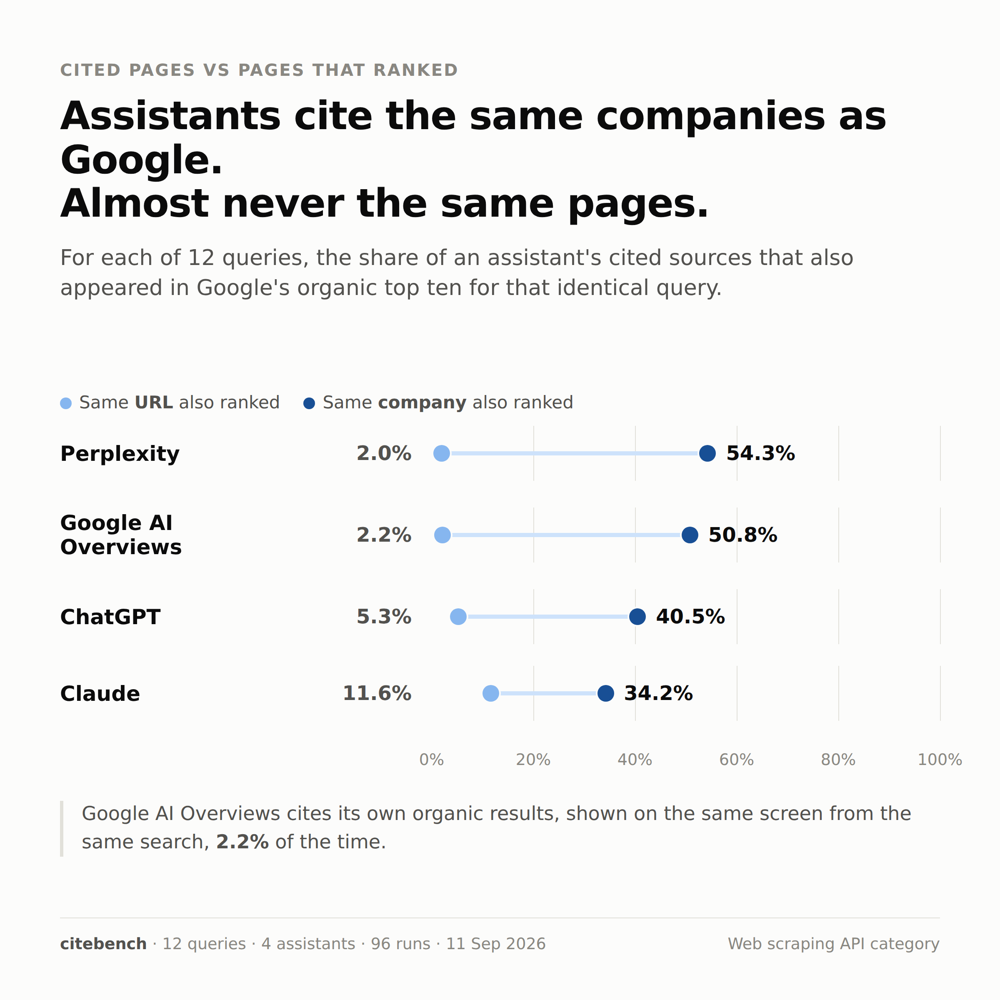

I recently came across [Openbenchmarks](https://openbenchmarks.com/), an independent benchmarking platform that publishes its data under CC-BY-4.0 and its code on GitHub, so that agents and humans have a second opinion when they pick a vendor. The idea stuck with me. So I ran a measurement of my own, to see what AI assistants are actually giving weight to right now.

## The question

Assistants now shortlist tools on people's behalf. When one does, it cites a handful of pages, and those pages are a small fraction of what ranks for the same question. Plenty of people sell advice about how to be one of those pages. Nobody publishes the measurement.

So, narrowly: in one category, over one collection window, **is there any measurable property of a page that distinguishes pages an assistant cited from pages that ranked organically for the identical question and were never cited?**

### The design decision that makes it answerable

The citation is not the result. It is the sampling mechanism.

There is no ground truth for what an assistant _should_ cite, which makes "which vendor gets cited most" unfalsifiable. It was not attempted. Instead:

| Element | Definition |
| --- | --- |
| **Cited group** | every unique page any assistant cited in any run |
| **Control group** | every unique page that appeared in Google's organic top ten for one of the same queries and that no assistant ever cited |
| **Overlap rule** | a page in both is counted as cited, never as control |
| **Measurement** | identical, same script, same pass, over both groups |

That converts an unfalsifiable question into a falsifiable one. Either the two piles differ on something measurable, or they do not.

### The second question, designed in before collection

Repeat four of the twelve queries three times on every assistant and measure how much of the citation set survives the repeat. This was in the design from the start, not added after the first question came back empty. It matters because if the channel is not reproducible, then no page-level advice about it can be tested at all, by anyone.

### What would have counted as a result, decided in advance

Every percentage below carries a 95% Wilson confidence interval, shown in brackets. Wilson rather than the normal approximation because the groups are small and several proportions sit at 0% or 100%, where the normal approximation produces intervals that run off the ends of the scale.

A measure counts as separating the two groups only when the two intervals do not overlap. Anything else is reported as inside the noise and is not a finding. A measure computed on fewer than ten pages is suppressed entirely rather than reported with a caveat.

I wrote that threshold down before I looked at any data. It is the reason the headline below is publishable rather than a failure.

## The twelve queries

Frozen before the first run and not edited afterwards. All twelve are buyer-intent queries for web scraping and crawling APIs. Someone typing these has a budget and a requirement; someone typing "how does web scraping work" does not, and the study is about tool selection.

The four marked **[S]** are the stability subset and were run three times on every assistant. The other eight were run once.

### Group A, open-ended category

| # | Query, verbatim |
| --- | --- |
| Q01 | `best web scraping API for JavaScript-heavy sites` **[S]** |
| Q02 | `what is the best web scraping API in 2026` |
| Q03 | `most reliable crawling API for production use` |
| Q04 | `best API for scraping search engine results` |

### Group B, head to head

| # | Query, verbatim |
| --- | --- |
| Q05 | `Firecrawl vs Apify` **[S]** |
| Q06 | `Bright Data vs ScrapingBee for large scale scraping` |
| Q07 | `Exa vs Firecrawl for AI agents` |
| Q08 | `Zyte vs Apify pricing comparison` |

### Group C, constraint led

| # | Query, verbatim |
| --- | --- |
| Q09 | `cheapest web scraping API with proxy rotation` **[S]** |
| Q10 | `scraping API that handles Cloudflare protection` **[S]** |
| Q11 | `web scraping API with the best free tier` |
| Q12 | `scraping API that returns clean markdown for LLMs` |

### Why these twelve

**The three groups probe different behavior.** Open-ended questions let the assistant choose the frame entirely. Head-to-head questions constrain it to two named vendors and test whether it reaches for vendor-owned comparison pages or third-party ones. Constraint-led questions test whether one dominant requirement pulls in a different source mix.

**The stability four span all three groups**: one open-ended, one head-to-head, two constraint-led. If instability had turned out to be concentrated in one group, that would itself have been a finding. It was not: ChatGPT scored 0.0%, 18.2%, 0.0% and 0.0% across the four, with no group pattern.

**No vendor is over-sampled by the query design.** Q05 to Q08 name eight distinct vendors once each. No vendor is named in more queries than any other.

### Citations returned per query, run 1

| Query | ChatGPT | Claude | Perplexity | Google AIO | Google organic | Distinct companies across the four assistants |
| --- | --- | --- | --- | --- | --- | --- |
| Q01 | 11 | 10 | 3 | 11 | 7 | 16 |
| Q02 | 8 | 9 | 6 | 6 | 6 | 18 |
| Q03 | 5 | 9 | 2 | 6 | 7 | 14 |
| Q04 | 7 | 9 | 5 | 5 | 6 | 14 |
| Q05 | 6 | 8 | 3 | 7 | 8 | 7 |
| Q06 | 7 | 10 | 5 | 8 | 7 | 12 |
| Q07 | 6 | 6 | 3 | 7 | 8 | 6 |
| Q08 | 4 | 3 | 2 | 6 | 8 | 5 |
| Q09 | 5 | 2 | 6 | 6 | 7 | 13 |
| Q10 | 8 | 11 | 4 | 12 | 6 | 18 |
| Q11 | 4 | 8 | 4 | 3 | 6 | 14 |
| Q12 | 4 | 10 | 6 | 12 | 7 | 15 |

Head-to-head queries pull the tightest source sets. Q08 drew citations from five companies in total across four assistants; Q10 drew from eighteen. A named-vendor comparison narrows the field; a constraint-led question widens it.

## The four assistants and the control

| Channel | Recorded as | What counted as a citation | Answers collected | Citations | Median per answer | Range | Distinct companies |
| --- | --- | --- | --- | --- | --- | --- | --- |
| ChatGPT | `chatgpt` | every linked source in the answer, in order | 20 | 118 | 6 | 4-11 | 25 |
| Claude | `claude` | every linked source in the answer, in order | 20 | 158 | 9 | 2-12 | 36 |
| Perplexity | `perplexity` | every numbered source in the citation rail | 20 | 80 | 4 | 2-8 | 24 |
| Google AI Overviews | `google_aio` | every link surfaced by the AI Overview panel | 19 | 150 | 7 | 3-12 | 42 |
| *Google organic (control)* | `google_organic` | *the organic top ten, AI Overview excluded* | *16* | *111* | *7* | *6-8* | *48* |

Claude cites more than twice as many sources per answer as Perplexity. Google AI Overviews draws on the widest set of companies of any assistant, 42, and is the only assistant whose breadth approaches organic search, 48.

Google AI Overviews returned nineteen answers rather than twenty because on Q01 run 3 it produced no AI Overview at all. That refusal is recorded as a row with an empty URL rather than silently skipped.

Assistants were queried signed in, with memory and custom instructions disabled, in a fresh chat per run. Google was queried in a fresh incognito window per run. 96 runs in total, collected on 11 September 2026 between 20:37 and 21:54 local time, in one sitting, from a single collection point in West Africa.

## What was measured

Every measure runs over both groups identically, by the same script, in the same pass. No measure was added after the data was seen, and one was planned and did not survive.

| Measure | Definition |
| --- | --- |
| **Open to citation crawlers** | robots.txt permits the crawlers that fetch pages *in order to cite them*: GPTBot, ClaudeBot, OAI-SearchBot, PerplexityBot, Google-Extended |
| **Blocks training scrapers** | robots.txt disallows bulk training scrapers: CCBot, Bytespider and similar |
| **Has structured data** | any JSON-LD block present |
| **Has Article markup** | JSON-LD `Article` or `BlogPosting` specifically |
| **Server-rendered** | the page's body text is present in raw HTML before JavaScript executes |
| **Has meta description** | a non-empty meta description |
| **Median word count** | visible text, descriptive only, no interval computed |
| **Median vendors named** | how many of the 51 known vendors the page names, word-boundary matched |
| **Median page age** | days since `datePublished`. **Suppressed**: only 1 of 30 control pages carried a machine-readable publish date |

Crawler access is split deliberately. An earlier version counted CCBot and Bytespider alongside GPTBot and ClaudeBot under one "open to AI" measure. That made a site which blocks bulk training scrapers while welcoming citation crawlers read as closed to AI, which is backwards. It is the deliberate and correct configuration. The two are now separate measures.

## Results

Sample: 278 unique pages, 244 measured successfully, **214 cited and 30 control**.

### The headline: five of six measures do not separate the groups

| Measure | Cited (n=214) | Control (n=30) | Verdict |
| --- | --- | --- | --- |
| **Has Article markup** | **41.6%** [35.2-48.3] | **0.0%** [0.0-11.4] | **separates** |
| Open to citation crawlers | 92.1% [87.6-95.0] | 93.3% [78.7-98.2] | inside the noise |
| Has structured data | 74.3% [68.1-79.7] | 83.3% [66.4-92.7] | inside the noise |
| Blocks training scrapers | 13.1% [9.2-18.3] | 10.0% [3.5-25.6] | inside the noise |
| Server-rendered | 94.9% [91.0-97.1] | 100.0% [88.6-100.0] | inside the noise |
| Has meta description | 93.9% [89.9-96.4] | 100.0% [88.6-100.0] | inside the noise |
| *Median word count* | *2487* | *2076* | *descriptive only* |
| *Median vendors named* | *2* | *1* | *descriptive only* |
| Median page age | suppressed | suppressed | control n=1 |

Two things worth noting.

**The direction is wrong on four of the five.** Cited pages carried _less_ structured data, were _less_ often server-rendered and _less_ often had a meta description than pages that ranked and were never cited. Every one of those is inside the noise, so none is a finding. But not one of them points the way the conventional advice predicts. If the advice were even weakly right, chance alone would not put four of five the wrong way round.

**Vendor share does not separate either.** 71.5% of cited pages are vendor-owned against 60.0% of control, intervals [65.1-77.1] and [42.3-75.4]. They overlap. That gap should not be reported as a finding.

### Robustness: does Article markup survive holding page type constant?

The obvious objection to the one surviving measure is that it is a page-type artifact. Article markup lives on articles. If cited pages skew toward blog posts and control pages toward product and category pages, the measure is detecting page type, not anything about being cited.

Tested by restricting both groups to vendor-owned pages only, the largest type in both.

| Measure, vendor pages only | Cited (n=153) | Control (n=18) |
| --- | --- | --- |
| **Has Article markup** | **45.1%** [37-53] | **0.0%** [0-18] |
| Any structured data | 83.0% [76-88] | 94.4% [74-99] |
| Open to citation crawlers | 93.5% [88-96] | 100.0% [82-100] |
| Blocks training scrapers | 7.8% [5-13] | 0.0% [0-18] |
| Server-rendered | 100.0% [98-100] | 100.0% [82-100] |
| Has meta description | 96.1% [92-98] | 100.0% [82-100] |
| *Median word count* | *2492* | *1841* |

**It survives.** Among vendor pages alone, 45.1% of cited pages carry Article markup and 0 of 18 control pages do, and the intervals still do not touch. So the finding is not purely page type.

It is still not a causal claim. Within vendor sites, the pages that get cited are blog and guide pages and the ones that rank are product and pricing pages, so Article markup may be a marker of _which page on the vendor's own site_ an assistant reaches for. Article markup by page type on cited pages supports that reading: independent roundups 63.6% [43-80], vendor pages 45.1% [37-53], forum and social pages 7.1% [2-23].

The honest statement is: cited pages are disproportionately article-shaped, and Article markup is the machine-readable trace of that. Whether adding the markup to a page that is not an article does anything is untested here and this study cannot answer it.

### Cited pages are largely not the pages that ranked

This was not one of the planned measures. It falls out of having both groups from the same queries, and it is the strongest result in the study. For each query, run 1, what share of an assistant's cited URLs also appeared in Google's organic top ten for that same query?

| Assistant | Same URL also ranked organically | Same company also ranked organically |
| --- | --- | --- |
| Claude | 11.6% (11 of 95) | 34.2% |
| ChatGPT | 5.3% (4 of 75) | 40.5% |
| Google AI Overviews | 2.2% (2 of 89) | 50.8% |
| Perplexity | 2.0% (1 of 49) | 54.3% |

**Read the two columns together.** Assistants mostly cite the same companies that rank, 34% to 54% of the time, and almost never the same pages, 2% to 12%. The consensus is about who is credible. The disagreement is about which page answers the question.

Note that Google AI Overviews sits at 2.2% against its own organic results, shown on the same screen, from the same search, in the same session. Whatever selects the AI Overview's sources is not reading off the ranking underneath it.

This is also the clearest justification for the study's design. If assistants mostly cited what already ranked, comparing cited against ranked would be comparing a set against its own subset. They do not, so the comparison is between two largely distinct populations, which is what makes the headline table meaningful.

### Run-to-run stability, the second question

Same question, three times, fresh session each time, memory off. The figure is the share of cited URLs that appeared in **every** run.

| Assistant | Mean over full three-run pairs | Per query |
| --- | --- | --- |
| Google AI Overviews | **62.7%** | 100.0%, 66.7%, 21.4% |
| Perplexity | 33.5% | 66.7%, 42.9%, 14.3%, 10.0% |
| Claude | 18.8% | 38.5%, 22.2%, 14.3%, 0.0% |
| ChatGPT | **4.5%** | 18.2%, 0.0%, 0.0%, 0.0% |

Overall mean across the fifteen three-run pairs: **27.7%**. Q01 on Google AI Overviews has two runs rather than three, because run 3 produced no AI Overview, and its 61.5% is excluded from the mean. Overlap falls mechanically as runs are added, so mixing a two-run pair into a three-run mean would inflate it.

**The ranges do not overlap at the extremes.** Google AI Overviews never dropped below 21.4%. ChatGPT never got above 18.2%. That is a fourteen-fold difference in mean, and unlike everything in the headline table it is not subtle.

**On three of four repeated queries, ChatGPT's second and third answers had zero URLs in common with the first.** Not a reshuffle of the same sources. No intersection. On Q01 it named sixteen distinct URLs across three runs and not one of them appeared in all three; thirteen appeared exactly once.

One caveat that cuts against reading too much into the middle of that table. Stability is sensitive to how many sources an assistant returns. Perplexity's best score, 66.7% on Q05, comes from a three-URL set, while Claude returns nine sources per answer on average and has more opportunity to vary. The gap between AI Overviews and ChatGPT is too large for that to explain. The middle is not cleanly ordered.

### The assistants do not agree with each other either

Mean pairwise overlap on the same query, run 1, across all twelve queries.

| Pair | URL level | Company level |
| --- | --- | --- |
| Claude vs Perplexity | 13.7% | 37.1% |
| ChatGPT vs Claude | 13.2% | 40.0% |
| Perplexity vs Google AIO | 10.4% | 17.0% |
| ChatGPT vs Perplexity | 9.5% | 34.3% |
| Claude vs Google AIO | 3.7% | 14.9% |
| ChatGPT vs Google AIO | 2.7% | 15.3% |

The same pattern as the section above, one level up: rough agreement on companies, almost none on pages. And the three chat assistants agree with each other, 34% to 40% at company level, roughly twice as much as any of them agrees with Google AI Overviews, 15% to 17%.

Together with the stability table, this says the source set behind an answer is not a property of the question. It is a property of the question, the assistant, and the moment.

### What each answer is made of

Citation-weighted over measured pages, so this describes what a typical answer is built from rather than what the page pool looks like.

| Source | n | Vendor-owned | Forum / social | Independent roundup | Other |
| --- | --- | --- | --- | --- | --- |
| ChatGPT | 96 | 85.4% | 5.2% | 6.2% | 3.1% |
| Perplexity | 68 | 83.8% | 1.5% | 5.9% | 8.8% |
| Claude | 143 | 82.5% | 9.1% | 7.0% | 1.4% |
| Google AI Overviews | 144 | 63.2% | 20.1% | 14.6% | 2.1% |
| *Google organic (control)* | *103* | *71.8%* | *3.9%* | *4.9%* | *18.4%* |

**Google organic is 71.8% vendor-owned.** So this is not assistants preferring vendor content. There is very little else in this category to cite. Anyone writing independently about scraping APIs is outnumbered several times over by the vendors writing about themselves, and every channel measured here inherits that.

**Google AI Overviews is the outlier on every column.** Least vendor-heavy, four times more forum and social sources than ChatGPT, most independent roundups. Put that beside its 62.7% stability and its 42 distinct companies, and AI Overviews behaves like a search engine with a summary on top. The three chat assistants behave like each other, and not like it.

Review sites are effectively absent from that table, but that is a measurement artifact rather than a finding. See the exclusions below.

### Citation is concentrated

506 citations from the four assistants, counted at the company level, with vendor subdomains collapsed so `docs.firecrawl.dev` and `firecrawl.dev` are one company.

| Company | Citations | Share | Cumulative |
| --- | --- | --- | --- |
| firecrawl.dev | 75 | 14.8% | 14.8% |
| brightdata.com | 46 | 9.1% | 23.9% |
| scrapingbee.com | 40 | 7.9% | 31.8% |
| apify.com | 35 | 6.9% | 38.7% |
| zyte.com | 21 | 4.2% | 42.9% |
| youtube.com | 18 | 3.6% | 46.4% |
| github.com | 18 | 3.6% | 50.0% |
| use-apify.com | 15 | 3.0% | 53.0% |
| zenrows.com | 14 | 2.8% | 55.7% |
| scrape.do | 13 | 2.6% | 58.3% |

|  | Companies | Top 5 | Top 10 | Cited once only |
| --- | --- | --- | --- | --- |
| Assistant citations | 71 | 42.9% | 58.3% | 24 |
| *Same, counted by hostname* | *82* | *37.0%* | *51.2%* | *29* |
| Google organic, control | 48 | n/a | 47.7% | n/a |

Both counting conventions are shown because they answer different questions. The company figure is the right one for a claim about market attention. The hostname figure is the one to use if the claim is about individual pages competing.

**Assistants are more concentrated than the organic results for the same queries**: 58.3% against 47.7% in the top ten, across more companies, 71 against 48, for a smaller total pool. Half of all assistant attention in this category lands on seven companies.

One oddity worth a second look. `use-apify.com` is the eighth most cited domain and it is not Apify's own domain.

## What the measurement excluded

34 of the 278 pages could not be fetched, so they are absent from every property measurement above. Their citations still count in the concentration table. **The exclusions are not random.**

| Status | Pages | Domains |
| --- | --- | --- |
| DNS failure | 20 | brightdata.com (16), docs.brightdata.com (4) |
| 403, refused | 8 | g2.com (2), medium.com, cloudflare.com, community.cloudflare.com, designrush.com, sourceforge.net, softwareadvice.com |
| 404 | 3 | dataforseo.com, developers.oxylabs.io, docs.zyte.com |
| 302, 400, 410 | 3 | apix-drive.com, app.scrapingbee.com, scraping.pro |

Twenty Bright Data pages, the second most cited company in the study, did not resolve from my collection point. That is a property of the network I collected on, not of Bright Data. One of the largest players in the category is therefore almost entirely absent from the property measurements while its 46 citations still count in the concentration table. Read the headline table as measured on the category minus Bright Data.

Eight pages were refused by bot rules rather than missing. G2, SourceForge, SoftwareAdvice, DesignRush and Medium block plain HTTP clients as policy. Those are exactly the review and comparison sites the study would most want to characterize, so **the review-site share is suppressed by the measurement method, not by assistant behavior, and cannot be read as evidence about review sites at all.** The honest value for that row is "unmeasurable".

There is a real methodological point in that second group. A study that measures pages over plain HTTP systematically under-samples the sites whose business model depends on blocking plain HTTP.

## What this cannot support

- **Anything about assistants in general.** Twelve queries, one category, one 77-minute window, one collection point, one set of accounts.
- **Any causal claim.** These are co-occurrences. Nothing here was manipulated.
- **Anything about review sites**, or about Bright Data's page properties, for the reasons above.
- **That the control represents the web.** It is Google's organic top ten, which is itself a ranked, filtered set. The comparison is cited-versus-ranked, and that is exactly how it should be described.
- **That the stability percentages would replicate.** Four queries, three runs, sixteen pairs. The spread between assistants is large enough to report; the exact percentages are not.
- **That any of this is stable over time.** One sitting. Two of the four assistants ship changes weekly.

## What I got wrong before I got it right

Every one of these made a number look better or cleaner than it was. They are listed because a measurement nobody can audit is an opinion with decimal places.

1. **Vendor classification was too narrow.** A hardcoded 28-domain list missed about twenty real vendors and did not match subdomains, so `docs.firecrawl.dev` counted as third-party. The vendor gap between groups read as 42.1% against 10.0%, a 32-point difference. Corrected, it is 71.5% against 60.0%, and inside the noise. **That error alone would have produced a headline finding that does not exist.** The list is now published with its ambiguous calls and deliberate exclusions written down.
2. **Vendor name matching hit ordinary English.** Brand tokens including "context", "steel", "reader", "spider" and "browser" were matched as substrings, so a sentence naming no vendor scored three, which is exactly the threshold for classifying a page as an independent roundup. Fixed with word boundaries plus a stoplist.
3. **The stability mean mixed run counts.** One two-run pair at 61.5% was inflating the headline. Three-run pairs only: 27.7%, not 29.8%.
4. **A median was reported from n=2.** Page age was computed from two control pages. A minimum of ten now suppresses any measure that thin, which is why page age is reported as suppressed rather than as a number.
5. **Page age accepted `dateModified`.** A nightly-regenerated product page read as one day old. Now `datePublished` only.
6. **Code-sample URLs counted as citations.** `example.com`, bare API endpoints and template literals inside code blocks were being scored as cited pages. Seventeen URLs dropped on that rule.
7. **A URL repair rule was destructive.** The regex that fixes run-on URLs from the Google results copy listed `.co` before `.com` in its TLD alternation, which quietly turned `brightdata.com` into `brightdata.co` and mangled 436 healthy URLs. Rewritten to require the brand token to actually repeat after the TLD, and tested against both broken and healthy cases.

Errors 1, 3 and 4 each changed a reported result. Error 7 would have invalidated the entire run. I found it by testing the repair against URLs that were already healthy, which is the test most people skip.

## What it adds up to

In order of how much weight each can carry.

**1. Assistants and organic search return almost disjoint sets of pages.** Between 2.0% and 11.6% of cited URLs also appeared in Google's organic top ten for the identical query, against 34% to 54% at the company level. They agree on who is credible and disagree on which page answers the question. This is the strongest result here and it was not the one I set out to find.

**2. Five of six measured page properties cannot distinguish cited pages from ranked-but-never-cited pages.** Only Article markup separates them, and it survives holding page type constant. Four of the five non-findings point the opposite way to the conventional advice.

**3. Repeat citation is unreliable, and the variance between assistants is enormous.** 62.7% for Google AI Overviews against 4.5% for ChatGPT.

**4. The assistants do not agree with each other either.** Mean pairwise URL overlap between two assistants on the same question is 2.7% to 13.7%.

**5. Citation is more concentrated than search.** The top ten companies take 58.3% of citations, against 47.7% for organic on the same queries.

**6. The category surface is vendor-owned on every channel, including organic.** 82% to 85% of what the three chat assistants cite, 63% of Google AI Overviews, and 72% of Google organic.

Two things follow from that, and you are welcome to disagree with both.

"Optimize your page to get cited" is the wrong frame right now, because the channel is not stable enough for a page-level change to be attributable to anything. And "AI search" is not one channel. Google AI Overviews was more stable, more diverse in source type and more willing to cite forums than any chat assistant here. Any claim about AI visibility that does not name the assistant is unfalsifiable.

## What I would measure next

In the order I would actually do them.

**1. Fix the two known measurement holes.** A headless browser fetch path for the domains that refused a plain HTTP client, and a second collection point so a DNS failure at one location does not remove a major vendor from the sample. Then re-run identically and see whether the headline still comes back empty. A negative result is only as strong as the coverage behind it.

**2. Make the control a real control.** Google's top ten is a ranked set, so the current comparison is cited-versus-ranked. Sampling pages from the category at random, from vendor sitemaps and independent publishers, would turn it into cited-versus-existing, which is the comparison that would actually test the optimization advice.

**3. Measure stability properly, because it is the finding.** Sixteen pairs is not enough for the number to travel. Thirty queries, five runs, four assistants, repeated at three times of day over two weeks. That design would answer whether instability is a property of the assistant, the question, or the hour, and whether it is drifting. It is also cheap, because it needs no page fetching at all.

**4. Test the one surviving measure with an intervention.** Article markup is a correlation with an unresolved artifact explanation. Add `Article` markup to a set of matched vendor pages that do not have it, leave a matched set alone, and watch citation over a quarter. That is the only design here that could produce a causal claim, and it is the claim every vendor actually wants.

**5. Watch concentration over time.** One measurement of 58.3% in the top ten is a fact about September 2026. The question a vendor at number eleven cares about is whether that number is rising.
